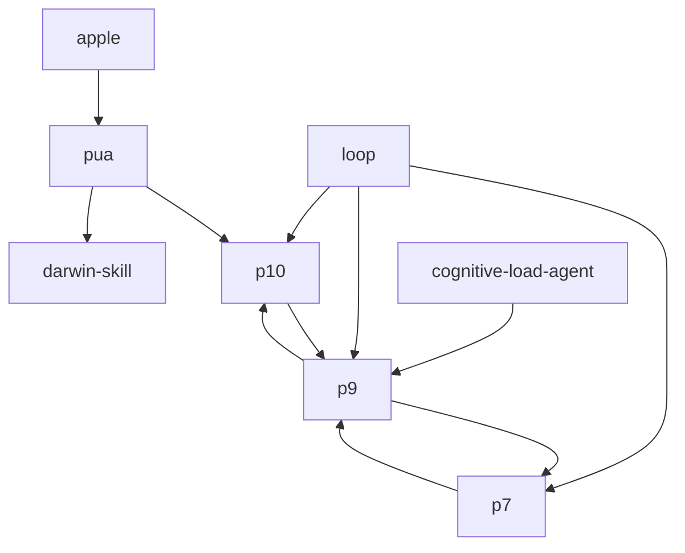

# Skill 依赖图

```mermaid
graph TD
    pua --> darwin-skill
    loop --> p10
    p9 --> p10
    pua --> p10
    loop --> p7
    p9 --> p7
    cognitive-load-agent --> p9
    loop --> p9
    p10 --> p9
    p7 --> p9
    apple --> pua
```

## 统计
- 有依赖关系的 skill: 5
- 最多被依赖的 skill: `loop` (3 个引用)

## 核心节点（被引用 ≥3 次）
- `loop`: 3 次引用
